---


## 👋 Olá! Eu sou o Moisés Sousa

<div align="center">
  
</div>

## 🚀 Sobre Mim

Desenvolvedor em formação com foco em **segurança digital** e **desenvolvimento de software**. Atualmente cursando **Análise e Desenvolvimento de Sistemas** em Fortaleza/CE, com uma paixão genuína por entender como as coisas funcionam e como torná-las mais seguras e eficientes.

```python
class Moises:
    def __init__(self):
        self.nome = "Moisés de Sousa"
        self.localizacao = "Fortaleza, CE"
        self.educacao = "Análise e Desenvolvimento de Sistemas"
        self.interesses = ["Desenvolvimento", "Cybersecurity", "Automação"]
        self.objetivo = "Criar soluções inovadoras e seguras"
    
    def skills(self):
        return {
            "linguagens": ["Python", "C", "HTML", "CSS"],
            "ferramentas": ["Linux", "Git", "VSCode"],
            "areas": ["Web Security", "Automação", "Análise de Vulnerabilidades"]
        }
```

---

## 🛠️ Stack Tecnológico

<div align="center">
  
### Linguagens


### Ferramentas & Tecnologias


### Áreas de Interesse


</div>

---

## 📊 GitHub Analytics

<div align="center">
  
  
</div>

<div align="center">
  
</div>

---

## 🏗️ Projetos em Destaque

<div align="center">

### 📝 [Gnosis - Notas e Tarefas](https://github.com/Moises-Sousa0/notas-e-tarefas-gnosis)


Sistema completo para gerenciamento de notas e tarefas com persistência em JSON
- ✅ Interface interativa via linha de comando
- 🔄 Controle de status e organização
- 🔍 Sistema de busca e listagem
- 💾 Persistência de dados estruturada

### 📚 [Livro de Registros](https://github.com/Moises-Sousa0/livro-de-registros---python)


Aplicação para criação e gestão de registros pessoais timestampados
- ⏰ Marcação automática de data/hora
- 🗂️ Organização estruturada de dados
- 💾 Persistência de dados estruturada


</div>

---

## 🎯 Objetivos e Metas

```mermaid
graph LR
    A[🎓 Formação em ADS] --> B[💼 Primeira Oportunidade]
    B --> C[🔒 Especialização em Security]
    C --> D[🚀 Projetos Inovadores]
    
    style A fill:#2d3748
    style B fill:#2d3748
    style C fill:#2d3748
    style D fill:#2d3748
```

<div align="center">



</div>

- 🔹 **Curto Prazo:** Conseguir primeira oportunidade em suporte técnico ou desenvolvimento
- 🔹 **Médio Prazo:** Especializar-me em cybersecurity e ethical hacking
- 🔹 **Longo Prazo:** Contribuir para projetos que impactem positivamente a segurança digital

---

## 💡 Soft Skills

<div align="center">

| 🧠 **Pensamento Analítico** | 🔍 **Atenção aos Detalhes** | 📚 **Aprendizado Contínuo** |
|:---:|:---:|:---:|
| Capacidade de quebrar problemas complexos | Foco na qualidade e precisão | Sempre buscando evoluir |

| 🛠️ **Resolução de Problemas** | 📋 **Organização** | 🤝 **Comunicação** |
|:---:|:---:|:---:|
| Abordagem estruturada para desafios | Metodologia clara de trabalho | Explicações técnicas didáticas |

</div>

---

## 📈 Atividade no GitHub

<div align="center">
  
</div>

---

## 🌐 Vamos Conectar?

<div align="center">
  <a href="https://www.linkedin.com/in/mois%C3%A9s-sousa-20132a267/">
    
  </a>
  <a href="mailto:moisessousanow@gmail.com">
    
  </a>
  <a href="https://github.com/Moises-Sousa0">
    
  </a>
</div>

---

<div align="center">
  
  
  ### 💫 _"Cada linha de código é uma oportunidade de criar algo melhor"_
  
  
</div>

---
